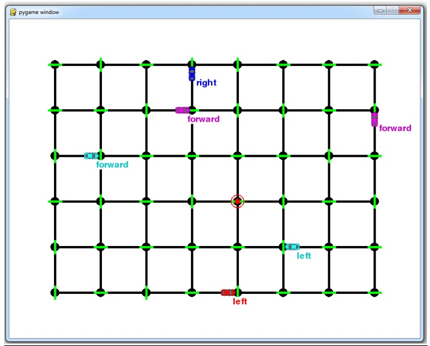

# Train a Smartcab How to Drive




Reinforcement Learning Project

## Install

This project requires Python 2.7 with the pygame library installed:
https://www.pygame.org/wiki/GettingStarted

How to install PyGame using Anaconda:
https://dmenin.wordpress.com/2016/06/14/how-to-install-pygame-using-anaconda/

It also uses the tabulate python library, which can be installed using:
`pip install tabulate`
If you dont want to install it, just replace the `prettyPrint` with the `simplePrint` method on the code

## Code

Open `smartcab/agent.py` and implement `LearningAgent`. Follow `TODO`s for further instructions.

## Run

Make sure you are in the top-level project directory `smartcab/` (that contains this README). Then run:

```python smartcab/agent.py```

OR:

```python -m smartcab.agent```
