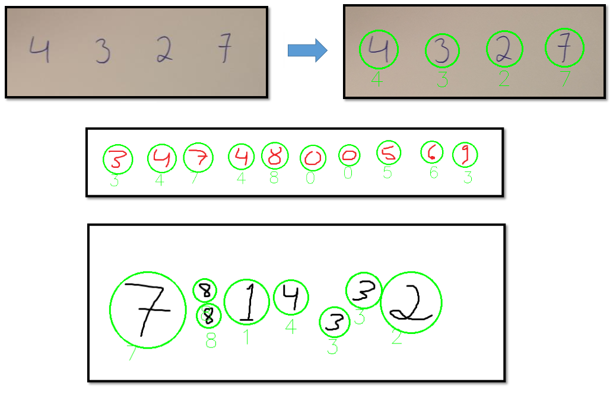
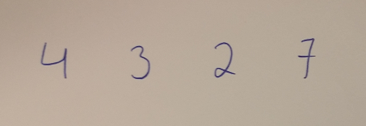
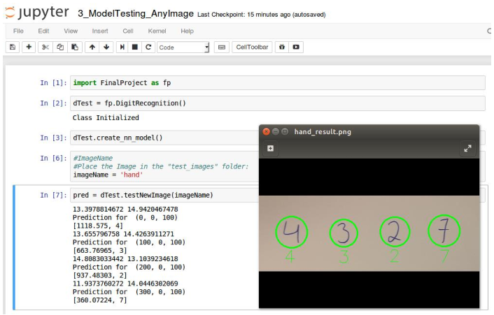

# Capstone Project:  Identifying Hand Written Digits (Deep Learning Project)

Deep Learning Project

## Install

This project requires Python 2.7 and Tensorflow (https://dmenin.wordpress.com/2016/08/05/tensorflow-working-on-an-unbuntu-virtual-machine/)

## Run

All the code shown on this report can be reproduced in two different ways. The advised way is to open the correspondent Jupyter Notebook and just run the code. There is one notebook for each major step: 

* Data Exploration
* Model Training
* Model Testing (from test set)
* Model Testing (any image)

Alternately, the FinalProject.py file can be executed uncommenting the desired session on the FinalProject.py file 

## How to test your image using the already trained model:

1) Place the desired image in the "test_images" folder. Don't worry if there are more images or even folders in there. Here is an example image (this is actually my own handwriting):
 
 

2) Call the test procedure. 

3) A folder called “<your_image_name>_result” will be created to store the prediction output. If the folder exist, its content will be deleted so we always get a fresh start.
 
4) An image also called “<your_image_name>_result” will be created where you will be able to see the numbers recognized and the prediction made to each one of them:

